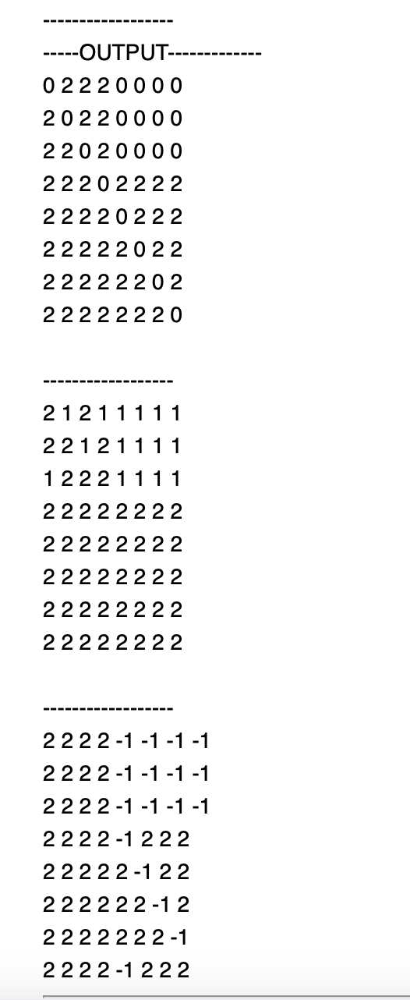

# LAB 5 - NEED GRADING  

## **Compiling Instruction** 
0. Ensure that Doctest is installed before running tests

1. Type the following command to compile(if necessary) & run the main program
    -  Checking out the output of **Computation of Cost Paths**
    -  Running tests
    
```bash
        g++ -o program main.cpp read_file.cpp algorithm.cpp
``` 
```bash
        g++  unittests.cpp read_file.cpp algorithm.cpp
```
2. Run complied files (run main program/run tests)
```bash
        ./program
        ./a.out 
```
## An example that we use to test the Expensive-Digraph-exact-paths
1. Barbell graph - 8 nodes
        

## Problem Summary

1. Matrix D1: It shows that there are +1 cost paths within the left cluster of the barbell graph (nodes 0 to 3). This is indicated by the presence of 1s connecting these nodes in a cycle. 

2. Matrix D0: The zeroes along the diagonal indicate self-loops with zero cost. In addition, nodes 0 through 3 also have zero-cost paths to each other, represented by the zeroes in the upper left quadrant of the matrix. This reflects the cyclic structure within the left cluster of the barbell, where the +1 and -1 edges cancel out to form zero-cost paths. There are no zero-cost paths leading into or out of the right cluster (nodes 5 to 9), as expected due to the unidirectionality of the barbell graph.

3. Matrix Dminus1: It presents the -1 cost paths within the right cluster of the barbell graph (nodes 5 to 9), as indicated by the presence of -1s connecting these nodes in a cycle. 

