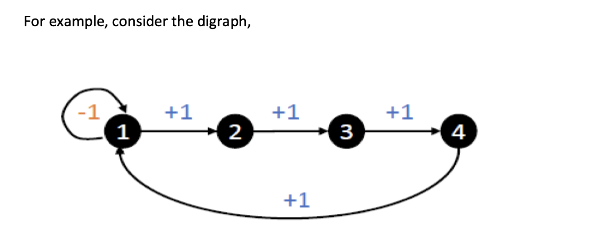
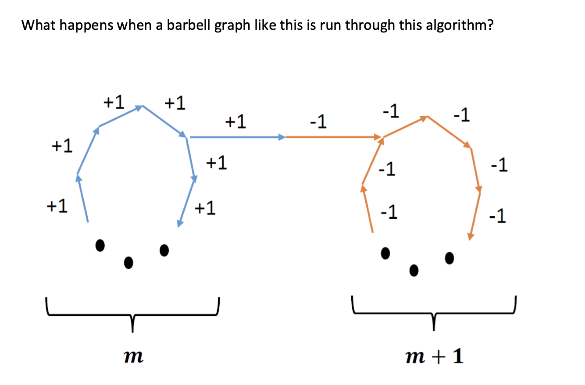
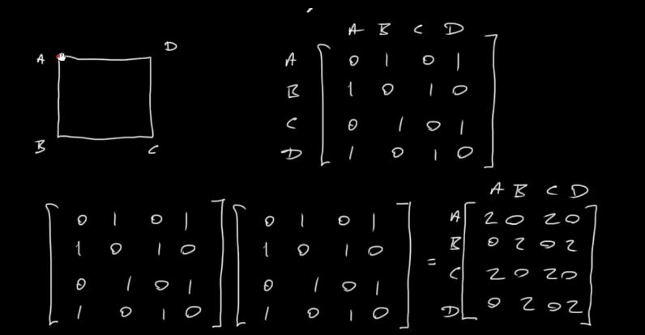
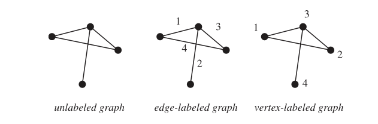

# LAB 5 - NEED GRADING  

## **Compiling Instruction** 
0. Ensure that Doctest is installed before running tests

1. Type the following command to compile(if necessary) & run the main program
    -  Checking out the output of **Computation of Cost Paths**
    -  Running tests
    
```bash
        g++ -o program main.cpp read_file.cpp algorithm.cpp
``` 
```bash
        g++  unittests.cpp read_file.cpp algorithm.cpp
```
2. Run complied files (run main program/run tests)
```bash
        ./program
        ./a.out 
```
## 2 examples that we use to test the Expensive-Digraph-exact-paths
1. Special case
        
2. Barbell graph
        

## Problem Clarification

1. Adjacency Matrices 
        
- n x m = R X C : n is number of rows, m is number of columns.
- [A B C D] X [A B C D]: work from left-hand side to top, couting the number of edges that connecting A->A for example, A-> B, A->C, A->D, B->A, B->B, B-> C, B-> D, etc. -> give you the info of how many walks of length 1,2,.. between vertices.
- Square your original matrix in order to find out the number of walks of length 2 / walk of length 3 - cube the matrix.

2. Directed Label Graph 
        
- a directed graph is an ordered pair G = (V, A) where:
        + V is a set whose elements are called vertices, nodes, or points.
        + A is a set of ordered pairs of vertices, called arcs, directed edges (sometimes simply edges with the corresponding set named E instead of A), arrows, or directed lines.

