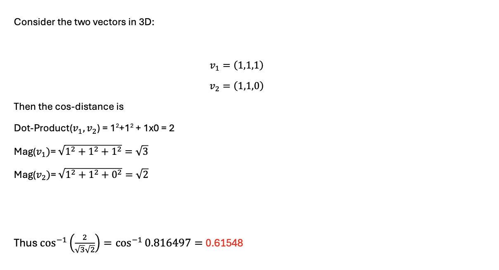

# LAB 7 - NEED GRADING  


## **Compiling Instruction** 
0. Ensure that Doctest is installed before running tests

1. Type the following command to compile specific files (**Main Function**, **Unit Tests**)
```bash
        g++ multiDimension_Vectors.cpp main_Vectors.cpp  
        g++ g++ unit_test.cpp multiDimension_Vectors.cpp
 
```
2. Run complied files
```bash
        ./a.out
```


## **Problem Clarification**
**Vectors in Multiple Dimensions**
- The provided C++ program and accompanying unit tests are designed to work with vectors in a space of multiple dimensions, typically referred to as R^k, where k is the number of dimensions. Each vector is represented by a list of doubles, indicating its magnitude along each dimension.


## **Function explanation**
1. **Vectors Struct**
These are modeled by the double_vector struct, which holds a dynamic array (a std::vector<double>) of components and an integer ID for identification purposes. This allows for representing vectors of any dimension greater than or equal to 2.

2. **dot_product(const double_vector & one, const double_vector & two)**
 A binary operation that takes two equal-length sequences of numbers (usually coordinate vectors) and returns a single number. This operation is crucial in calculating the cosine of the angle between two vectors, which is used to determine their similarity.

3. **magnitude(const double_vector & my_vector)**
Calculates the magnitude (or length) of a vector from its origin to its endpoint. The magnitude is calculated using the Pythagorean theorem, sqrt(x^2 + y^2), utilizing the square function for squaring the components.

4. **cosine_distance(const double_vector & one, const double_vector & two)**
Computes the cosine distance between two vectors. It first calculates the dot product and the magnitudes of both vectors, then uses these to calculate the cosine of the angle between them. It ensures the cosine value stays within the valid range [-1.0, 1.0] before returning the arc cosine (in radians) of the dot product divided by the product of the magnitudes, which effectively gives the cosine distance.

        


