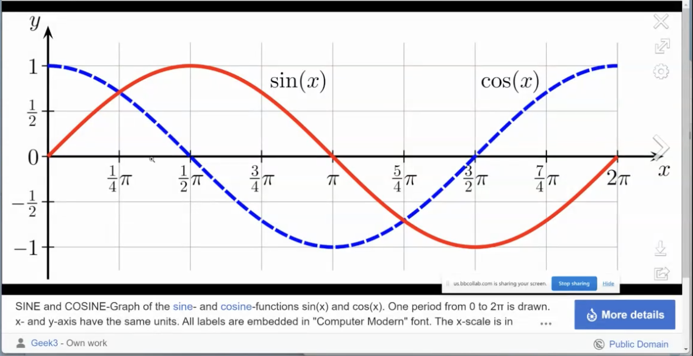

# WEEK 8 EXERCISE - NEED GRADING  


## **Compiling Instruction** 
0. Ensure that Doctest is installed before running tests

1. Type the following command to compile specific files (**Main Function**, **Unit Tests**)
```bash
        g++ double_Vector.cpp main_double_Vector.cpp 
        g++ unit_test.cpp double_Vector.cpp
 
```
2. Run complied files
```bash
        ./a.out
```

## **Problem Clarification**
**Vectors in 2 dimensions**
- The Vector which has magnitude in two directions i.e x-axis and y-axis can be called a 2D vector. The Vector which has magnitude in three directions i.e x-axis and y-axis, z-axis can be called a 3D vector.

**Sin-Cos diagram**


## **Function explanation**
1. **square(const double & d)**
This function takes a double value d by reference and returns its square. It’s a utility function used to simplify other calculations in the file.

2. **dot_product(const double_vector & one, const double_vector & two)**
Calculates the dot product of two double_vector objects. The dot product is computed as the sum of the products of their corresponding x and y components. This function assumes double_vector has x and y attributes.

3. **magnitude(const double_vector & my_vector)**
Calculates the magnitude (or length) of a vector from its origin to its endpoint. The magnitude is calculated using the Pythagorean theorem, sqrt(x^2 + y^2), utilizing the square function for squaring the components.

4. **cosine_distance(const double_vector & one, const double_vector & two)**
Computes the cosine distance between two vectors. It first calculates the dot product and the magnitudes of both vectors, then uses these to calculate the cosine of the angle between them. It ensures the cosine value stays within the valid range [-1.0, 1.0] before returning the arc cosine (in radians) of the dot product divided by the product of the magnitudes, which effectively gives the cosine distance.

        


